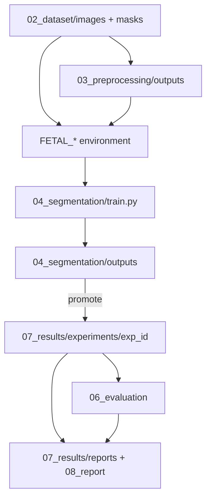
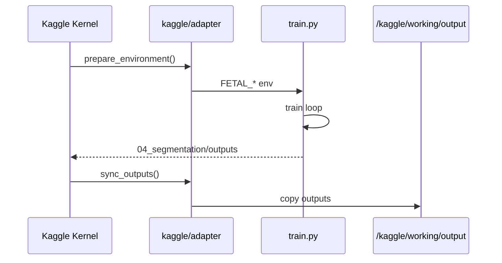

# Fluxo de Dados

**Versão:** 1.0

---

## 1. Visão geral

Este documento descreve como os **dados**, **configurações** e **artefactos** circulam entre dataset, pré-processamento, treino, avaliação e resultados.



---

## 2. Dados de entrada

### 2.1 Dataset bruto (`02_dataset`)

```text
02_dataset/
├── images/     # imagens originais
└── masks/      # máscaras de referência
```

Emparelhamento: mesmo `stem` de ficheiro (ex.: `case_001.png` + `case_001.png`).

Extensões suportadas: `.png`, `.jpg`, `.jpeg`, `.tif`, `.tiff`, `.bmp`.

### 2.2 Kaggle

Input montado em `/kaggle/input/<dataset_name>/` — adapter deteta e ajusta `FETAL_DATASET_PATH`.

---

## 3. Pré-processamento (opcional)

Notebooks e scripts em `03_preprocessing` podem gerar versões normalizadas ou ROIs.

```text
03_preprocessing/outputs/  →  pode alimentar images/ efetivas via config
```

Se não usado, `train.py` lê diretamente de `02_dataset`.

---

## 4. Configuração

| Camada | Ficheiro | Conteúdo |
|--------|----------|----------|
| Runtime | `10_runtime/<provider>/config.yaml` | Paths, device, provider |
| Pipeline | `04_segmentation/config.yaml` | Epochs, batch, arquitetura UNet |

Ordem de precedência para paths: **variáveis de ambiente** (`FETAL_*`) > runtime config > defaults em código.

---

## 5. Fluxo de treino

1. **Adapter** define `FETAL_IMAGES_DIR`, `FETAL_MASKS_DIR`, `FETAL_OUTPUT_PATH`, `FETAL_DEVICE`.
2. **`dataset.py`** lista pares e carrega arrays normalizados `[0, 1]`.
3. **`model.py`** instancia UNet MONAI.
4. **`train.py`** executa loop, grava:
   - `outputs/checkpoints/last.pt`
   - `outputs/metrics.json`
   - `outputs/logs/` (reservado)

### 5.1 Dry-run

Sem pares imagem/máscara: `metrics.json` com `status: dry_run` — útil para validar runtime.

---

## 6. Promoção para resultados experimentais

| Origem | Destino | Mecanismo |
|--------|---------|-----------|
| `04_segmentation/outputs/` | `07_results/experiments/<exp_id>/` | Script de promoção (futuro) |
| `metrics.json` | `experiments/<id>/metrics.json` | Cópia |
| `checkpoints/last.pt` | `experiments/<id>/checkpoints/` | Cópia |
| — | `manifest.yaml` | Metadados manuais ou gerados |

Ver [../governance/experiment_standards.md](../governance/experiment_standards.md).

---

## 7. Avaliação e comparação

```text
06_evaluation/
├── metrics/
├── tables/
└── plots/
```

Consome outputs de uma ou mais experiências em `07_results/experiments/`.

---

## 8. Saídas académicas

| Destino | Tipo |
|---------|------|
| `07_results/figures/` | Figuras gerais |
| `07_results/comparisons/` | Comparações entre experiências |
| `07_results/reports/` | Tabelas e exports |
| `08_report/` | Relatório final |
| `09_presentation/` | Slides |

---

## 9. Fluxo Kaggle (específico)



---

## 10. Integridade e rastreabilidade

Cada experiência deve poder responder:

- Que **dataset path** foi usado?
- Que **commit git** e **provider**?
- Que **config** (snapshot em `config_snapshot.yaml`)?
- Onde está o **checkpoint** final?

Campos obrigatórios no `manifest.yaml`.

---

## 11. Documentos relacionados

- [system_architecture.md](system_architecture.md)
- [runtime_architecture.md](runtime_architecture.md)
- [experiment_standards.md](../governance/experiment_standards.md)

---

## 12. Revisão

| Versão | Data | Alteração |
|--------|------|-----------|
| 1.0 | 2026-05-29 | Criação — Fase 2 |
