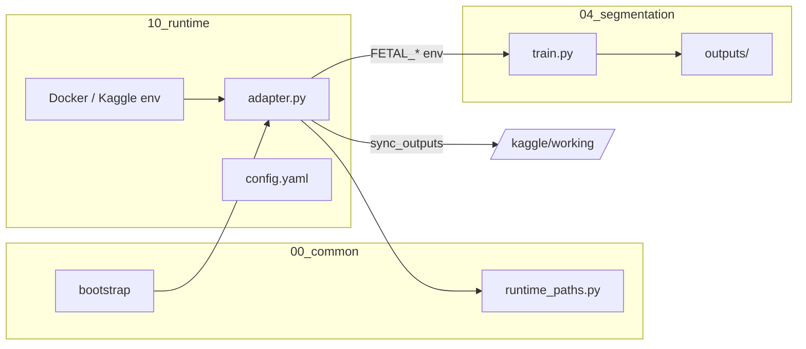

# Arquitetura de Runtime

**Versão:** 1.0

---

## 1. Definição

Um **runtime** é um ambiente de execução que:

1. Prepara variáveis e paths (`prepare_environment`).
2. Valida pré-condições (`validate_runtime`).
3. Opcionalmente verifica CUDA (`check_cuda`) ou sincroniza outputs (`sync_outputs` — Kaggle).
4. Delega o treino para **`04_segmentation/train.py`**.

O runtime **não** implementa epochs, loss backward, ou definição de modelo.

---

## 2. Diagrama de componentes



---

## 3. Providers

| Provider | Diretório (alvo) | Device | Infra |
|----------|------------------|--------|-------|
| `local_cpu` | `10_runtime/local_cpu` | CPU | Docker `python:3.11-slim` |
| `local_gpu` | `10_runtime/local_gpu` | CUDA | Docker `pytorch` CUDA 12.1 |
| `kaggle` | `10_runtime/kaggle` | CUDA | Kaggle Notebook |

---

## 4. Adapter pattern

Cada provider expõe `adapter.py` com API comum:

| Função | `local_cpu` | `local_gpu` | `kaggle` |
|--------|-------------|-------------|----------|
| `prepare_environment()` | Sim | Sim | Sim |
| `resolve_paths_runtime()` | Sim | Sim | Sim |
| `validate_runtime()` | Sim | Sim | Sim |
| `check_cuda()` | No-op OK | Obrigatório | Obrigatório |
| `sync_outputs()` | — | — | Copia para `/kaggle/working/output` |

Implementação partilhada: `00_common/runtime_paths.py`.

---

## 5. Configuração por runtime

Ficheiro `config.yaml` por provider:

```yaml
provider: local_gpu
dataset_path: ./02_dataset
output_path: ./04_segmentation/outputs
device: cuda
```

A pipeline lê **hiperparâmetros** de `04_segmentation/config.yaml`; o runtime define **onde** e **com que device** executar.

---

## 6. Bootstrap e entrypoint

### 6.1 `10_runtime/entrypoint.sh` (Docker)

1. Deteta `BOOTSTRAP_PROFILE`.
2. Executa adapter correspondente.
3. Corre `00_common/bootstrap/bootstrap.py`.
4. Inicia JupyterLab.

### 6.2 Perfis

| `BOOTSTRAP_PROFILE` | Strict default | Stack GPU |
|---------------------|----------------|-----------|
| `local_cpu` | Não | Opcional (WARN) |
| `local_gpu` | Sim | Obrigatório |
| `kaggle` | Sim | Obrigatório |

Aliases legados: `cpu` → `local_cpu`, `gpu` → `local_gpu`.

---

## 7. Fluxo de execução canónico

```bash
# 1. Preparar (opcional se train.py auto-prepara)
python 10_runtime/local_gpu/adapter.py

# 2. Treinar (único entry point)
python 04_segmentation/train.py
```

No Kaggle: `launch.ipynb` executa os mesmos passos.

---

## 8. Variáveis de ambiente

| Variável | Definida por |
|----------|--------------|
| `FETAL_PROVIDER` | Adapter |
| `FETAL_DATASET_PATH` | Adapter |
| `FETAL_OUTPUT_PATH` | Adapter |
| `FETAL_IMAGES_DIR` | Adapter |
| `FETAL_MASKS_DIR` | Adapter |
| `FETAL_DEVICE` | Adapter |
| `PROJECT_ROOT` | Adapter / Docker |
| `BOOTSTRAP_PROFILE` | Docker / Kaggle |

---

## 9. Extensão: novo provider

Checklist para `10_runtime/runpod/` (exemplo):

1. `config.yaml` com paths do provider.
2. `adapter.py` implementando API comum.
3. `requirements.txt` ou imagem Docker.
4. Entrada em `VALID_PROFILES` no bootstrap.
5. Documentação em MkDocs.
6. **Sem** `train_runpod.py`.

---

## 10. Anti-padrões

| Anti-padrão | Motivo |
|-------------|--------|
| `train_local.py` no runtime | Duplica pipeline |
| Modelo diferente por cloud | Quebra reprodutibilidade |
| Output path hardcoded só no Kaggle | Usar `FETAL_OUTPUT_PATH` |

---

## 11. Documentos relacionados

- [system_architecture.md](system_architecture.md)
- [data_flow.md](data_flow.md)
- [../governance/project_governance.md](../governance/project_governance.md)

---

## 12. Revisão

| Versão | Data | Alteração |
|--------|------|-----------|
| 1.0 | 2026-05-29 | Criação — Fase 2 |
