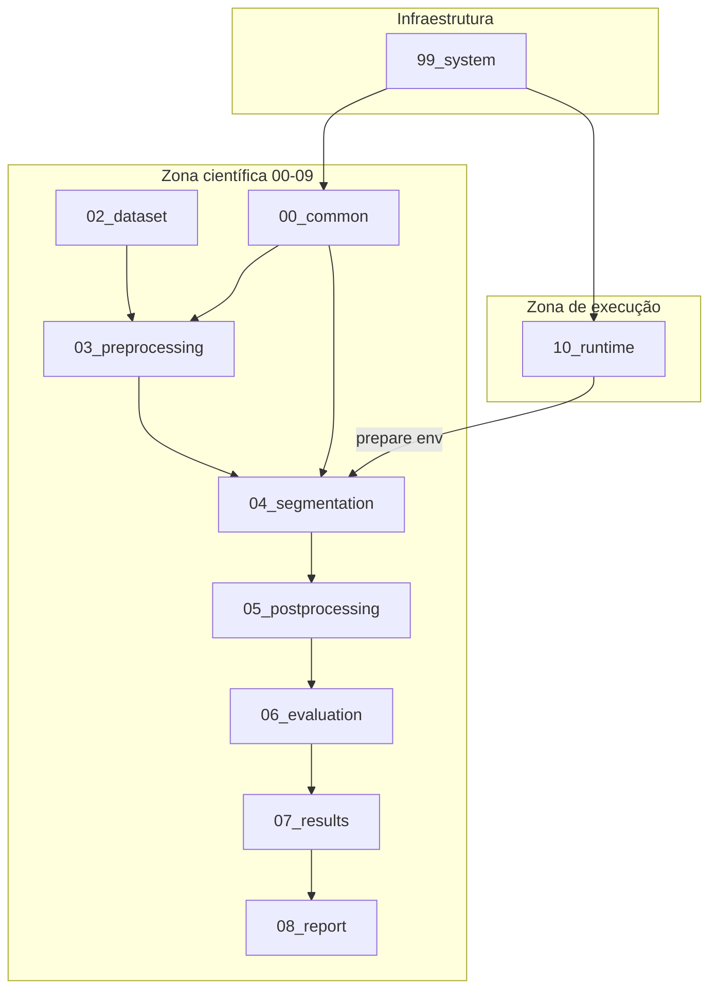

# Arquitetura de Sistema

**Versão:** 1.0  
**Estado:** documentação normativa (paths legados até Fase 10)

---

## 1. Visão geral

O projeto `fetal_vein_segmentation` é um sistema académico de **segmentação de imagens biomédicas** organizado em camadas numeradas (00–10) e uma zona de infraestrutura (`99_system`).



---

## 2. Princípio fundamental

```text
Mesmo código · Mesmo dataset · Mesmo output · Mesma estrutura
Diferente ambiente de execução
```

A **pipeline científica** é única. Os **runtimes** apenas configuram o ambiente (paths, device, dependências, sincronização Kaggle).

---

## 3. Componentes principais

### 3.1 Biblioteca comum (`00_common`)

| Elemento | Função |
|----------|--------|
| Notebooks `01`–`07` | Funções reutilizáveis (filtros, morfologia, visualização, provider) |
| `runtime_paths.py` | Resolução de paths e variáveis `FETAL_*` |
| `bootstrap/` | Validação de estrutura, dependências e runtime |

### 3.2 Pipeline de segmentação (`04_segmentation`)

| Ficheiro | Função |
|----------|--------|
| `train.py` | Entry point canónico de treino |
| `dataset.py` | Pares imagem/máscara, carregamento |
| `model.py` | Construção UNet (MONAI) |
| `config.yaml` | Hiperparâmetros da experiência |
| `outputs/` | Checkpoints, logs, métricas |

### 3.3 Runtimes (`10_runtime`)

| Provider | Ambiente |
|----------|----------|
| `local_cpu` | Docker CPU + Jupyter |
| `local_gpu` | Docker CUDA + MONAI |
| `kaggle` | Notebook cloud GPU |

Ver [runtime_architecture.md](runtime_architecture.md).

### 3.4 Infraestrutura (`99_system`)

Governação, templates, MkDocs, auditoria, ferramentas de migração — **sem** lógica de treino.

---

## 4. Boundaries (limites)

| De | Para | Contrato |
|----|------|----------|
| Runtime | Pipeline | Variáveis de ambiente `FETAL_*` |
| Pipeline | Results | Ficheiros em `outputs/` + promoção para `07_results` |
| Bootstrap | Todo o repo | Pastas obrigatórias e checks de dependências |
| Notebooks | Pipeline | Chamada a `train.py`, sem duplicar loop de treino |

---

## 5. O que não faz parte do sistema

- Lógica de treino por runtime (`train_kaggle.py`, etc.).
- Pacote `src/fetal_vein` (decisão: layout flat numerado).
- Pasta `10-docker` legada (deprecada).

---

## 6. Evolução prevista

| Extensão | Local |
|----------|-------|
| RunPod / AWS / Azure | Novo subfolder em `10_runtime/<provider>/` |
| Métricas avançadas | `04_metrics.ipynb` + `06_evaluation` |
| API REST | Fora de âmbito atual; seria módulo separado |

---

## 7. Documentos relacionados

- [runtime_architecture.md](runtime_architecture.md)
- [data_flow.md](data_flow.md)
- [technology_stack.md](technology_stack.md)
- [../governance/project_governance.md](../governance/project_governance.md)

---

## 8. Revisão

| Versão | Data | Alteração |
|--------|------|-----------|
| 1.0 | 2026-05-29 | Criação — Fase 2 |
