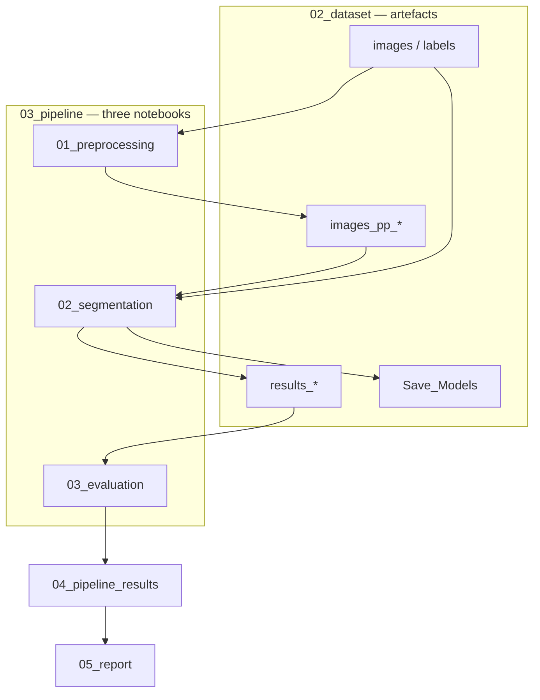

# System architecture

**Version:** 5.0  
**Scope:** relationships and principles (not execution detail)

---

## Why this structure exists

The repository adopts a **notebook-centric architecture** on **Google Colab** so that each stage of the assignment remains **transparent, reviewable, and aligned with course reference material**. Semantic segmentation of the fetal umbilical vein is implemented as a staged experiment: optional preprocessing variants, shared segmentation methodology, and comparative evaluation.

Execution steps, notebook paths, and configuration tables are **not** documented here. See the [Implementation](../portal/implementation.md) index and [03_pipeline/README.md](../portal/implementation.md#start-here).

---

## Component relationships

| Layer | Role (WHY) |
|-------|------------|
| `02_dataset/` | Single contract for all scientific inputs and outputs |
| `03_pipeline/` | Three self-contained Colab stage notebooks (no cross-notebook `%run`) |
| `04_pipeline_results/` | Aggregated comparison outside mutable dataset tree |
| `05_report/` | Written deliverable separate from code |
| `01_academic/` | Read-only lecturer reference; pipeline adapts paths only |
| `06_documentation/` | Normative rules and architectural rationale (this site) |

Notebook structure is defined in [scientific_notebook_standards.md](../01_governance/scientific_notebook_standards.md).

---

## Design principles

| Principle | Rationale |
|-----------|-----------|
| Lecturer-aligned segmentation core | Preserves traceability to course UNet/MONAI reference |
| Explicit artefact layout | Reviewers can locate data, models, and masks without implicit paths |
| Identifier-based pairing | Image–label matching by patient id, not list order |
| Non-destructive originals | `images/` and `labels/` remain the ground-truth source |
| Self-contained stages | Each pipeline notebook runs independently on Colab; workflow order is documented in `03_pipeline/README.md` |

---

## Related documents

- [Data flow](data_flow.md) — artefact movement and integrity rules
- [Design evolution](design_evolution.md) — why automation was not adopted
- [Project governance](../01_governance/project_governance.md)
