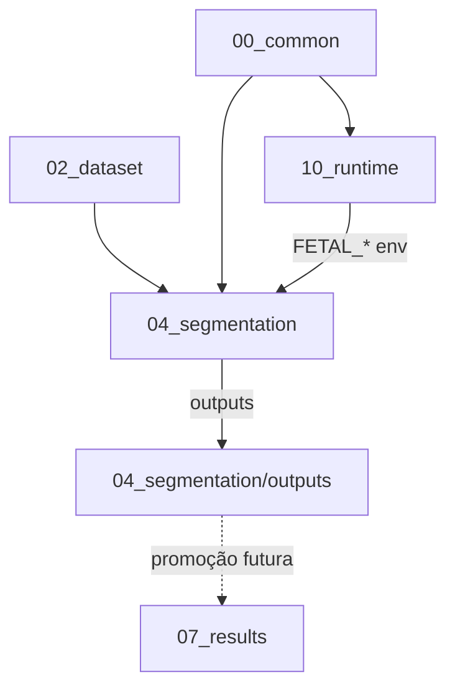

# Estrutura do Projeto

**Uniformização:** Nível A (aprovado) — paths **alvo** após Fase 10.  
**Estado atual no disco:** muitas pastas ainda com hífen (`00-common`, etc.).

---

## Visão geral

```text
fetal_vein_segmentation/
├── 00_common/              # Biblioteca + bootstrap
├── 01_literature_review/
├── 02_dataset/
├── 03_preprocessing/
├── 04_segmentation/        # Pipeline única (train.py)
├── 05_postprocessing/
├── 06_evaluation/
├── 07_results/
├── 08_report/
├── 09_presentation/
├── 10_runtime/             # local_cpu, local_gpu, kaggle
└── 99_system/                # Infraestrutura e documentação
```

---

## Zonas e responsabilidades

| Pasta (alvo) | Responsabilidade | Treino? |
|--------------|------------------|---------|
| `00_common` | Funções reutilizáveis, notebooks auxiliares, bootstrap | Não |
| `02_dataset` | Imagens e máscaras brutas | Não |
| `03_preprocessing` | Pré-processamento e outputs | Não |
| `04_segmentation` | **Pipeline única** — `train.py`, `dataset.py`, `model.py` | **Sim** |
| `05_postprocessing` | Pós-processamento | Não |
| `06_evaluation` | Métricas, tabelas, gráficos | Não |
| `07_results` | Figuras, comparações, relatórios, experiências | Não |
| `08_report` | Relatório académico | Não |
| `09_presentation` | Apresentação | Não |
| `10_runtime` | Docker, adapters, configs por ambiente | Não |
| `99_system` | Governação, MkDocs, ferramentas | Não |

---

## Dependências entre módulos



### Contratos principais

| De | Para | Mecanismo |
|----|------|-----------|
| Runtime | Pipeline | Variáveis `FETAL_DATASET_PATH`, `FETAL_OUTPUT_PATH`, `FETAL_DEVICE` |
| Pipeline | Disco | `04_segmentation/outputs/` |
| Bootstrap | Repositório | Validação de pastas e dependências |
| Notebooks | Pipeline | Chamada a `train.py` — sem duplicar treino |

---

## `00_common` (detalhe)

| Conteúdo | Função |
|----------|--------|
| `01_functions.ipynb` … `07_training_provider.ipynb` | Biblioteca interativa |
| `runtime_paths.py` | Resolução de paths partilhada pelos adapters |
| `bootstrap/` | `bootstrap.py`, `config.py`, `checks.py` |

---

## `04_segmentation` (detalhe)

| Ficheiro | Função |
|----------|--------|
| `train.py` | Entry point canónico de treino |
| `dataset.py` | Pares imagem/máscara |
| `model.py` | UNet (MONAI) |
| `config.yaml` | Hiperparâmetros |
| `outputs/` | Checkpoints, logs, `metrics.json` |

---

## `10_runtime` (detalhe — alvo Nível A)

```text
10_runtime/
├── entrypoint.sh
├── local_cpu/
├── local_gpu/
└── kaggle/
```

Cada provider: `runtime_adapter.py` (alvo), `config.yaml`, `requirements.txt`.

---

## `99_system` (detalhe)

```text
99_system/
├── 04_tools/                 # alvo — scripts de automação
└── 05_documentation/
    ├── 01_governance/
    ├── 02_architecture/
    ├── 03_templates/
    ├── 04_migration/
    └── 05_mkdocs/            # este site
```

---

## Relação com documentação

- [Arquitetura](../architecture/system_architecture.md)
- [Fluxo de dados](../architecture/data_flow.md)
- [Nomenclatura](../governance/naming_conventions.md)
- [Plano de migração](../migration/migration_plan.md)
