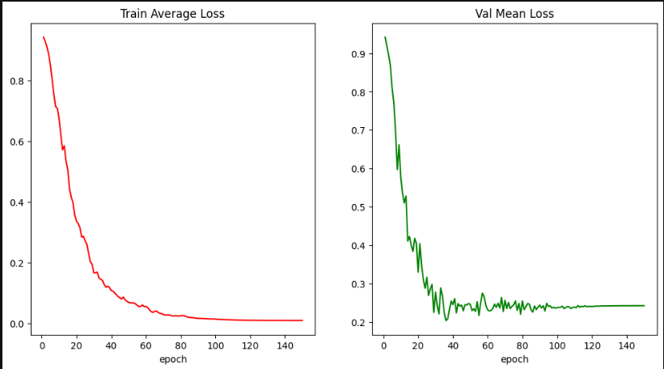
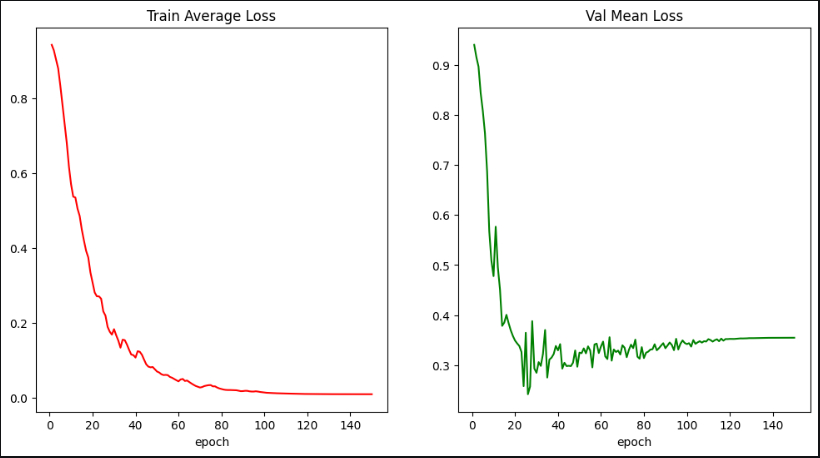
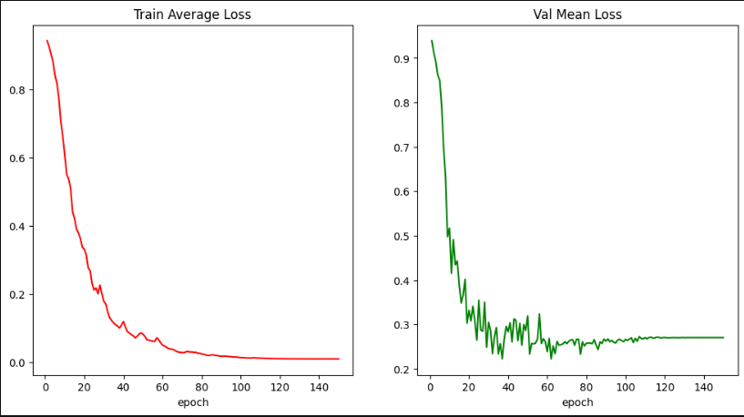
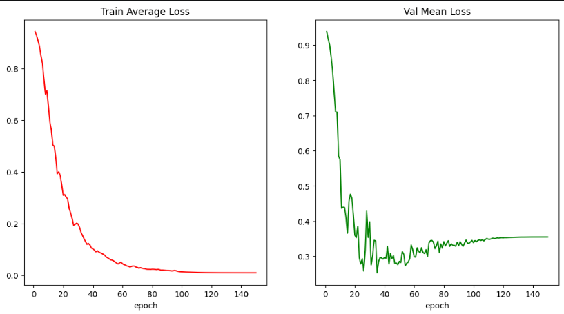
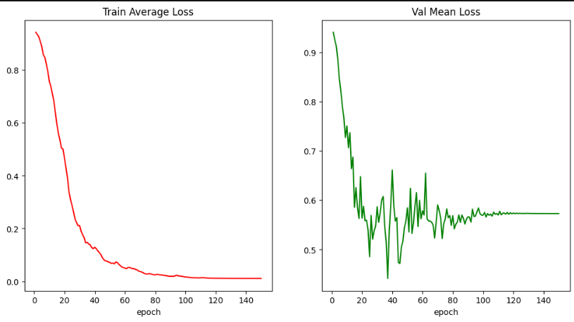
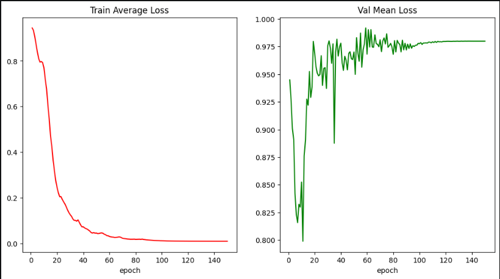

# Training Results

## Original Dataset

The model trained on the original ultrasound images exhibited stable convergence throughout the training process. Training loss decreased steadily while validation loss reached a plateau after the initial learning phase.

---

## PP1 — Average Filter

The Average Filter preprocessing strategy produced stable training behaviour with convergence characteristics comparable to the original dataset.
# Results

This section presents the results obtained during model training, segmentation evaluation and morphological post-processing. The objective is to analyse the impact of different preprocessing strategies and mathematical morphology operations on fetal ultrasound image segmentation performance.

---

# Training Analysis

To evaluate the learning behaviour of the segmentation network, training and validation loss curves were analysed for each preprocessing configuration. These curves provide insight into optimisation stability, convergence behaviour and generalisation capability.

## Original Dataset

Figure 1 shows the training and validation loss obtained using the original ultrasound images.

Training loss decreased steadily throughout optimisation, falling from approximately 0.95 to values close to zero. Validation loss followed a similar trend, decreasing rapidly during the first epochs before stabilising around 0.24 after approximately 40 epochs.

The absence of a significant increase in validation loss suggests that severe overfitting did not occur. The relatively small gap between training and validation loss indicates satisfactory generalisation capability.

---

## PP1 — Average Filter

Figure 2 presents the training curves obtained using Average Filter preprocessing.

The model converged successfully and exhibited behaviour comparable to the baseline experiment. Noise reduction simplified optimisation while preserving relevant anatomical information. The resulting segmentation quality showed slight improvements over the original dataset.

---

## PP2 — Median Filter

Figure 3 presents the training curves obtained using Median Filter preprocessing.

Training and validation losses evolved consistently throughout optimisation. Although convergence was stable, the final segmentation metrics were lower than those obtained using Gaussian filtering. This behaviour suggests that excessive smoothing may have removed useful image features required by the segmentation network.

---

## PP3 — Gaussian Filter

Figure 4 presents the training curves obtained using Gaussian Filter preprocessing.

This configuration produced one of the most stable optimisation processes observed during the study. Validation loss decreased rapidly and remained stable throughout the remaining epochs. The resulting segmentation metrics confirmed that Gaussian filtering provided the most favourable balance between noise reduction and preservation of relevant anatomical structures.

---

## PP4 — Sobel Filter

Figure 5 presents the training curves obtained using Sobel Filter preprocessing.

Although convergence was achieved successfully, segmentation quality was considerably lower than that obtained with intensity-based filtering approaches. The emphasis on image gradients appears to have reduced the amount of information available for accurate tissue representation.

---

## PP5 — Laplacian Filter

Figure 6 presents the training curves obtained using Laplacian Filter preprocessing.

The optimisation process converged successfully; however, the final segmentation performance remained substantially lower than all other evaluated approaches. The strong enhancement of image edges and high-frequency components appears to have negatively affected feature extraction and segmentation quality.

---

## Training Summary

All experiments converged successfully and no severe optimisation instability was observed.

However, convergence alone was not sufficient to guarantee superior segmentation performance. The evaluation results demonstrated that preprocessing quality played a fundamental role in determining segmentation accuracy.

Among all evaluated preprocessing approaches, Gaussian filtering (PP3) produced the most favourable combination of optimisation stability, validation behaviour and segmentation performance.

---

# Morphological Post-processing Results

Following segmentation, four mathematical morphology operations were evaluated:

* Erosion
* Dilation
* Opening
* Closing

The objective was to determine whether post-processing could improve segmentation quality by reducing artefacts and refining object boundaries.

---

## Closing Operation

*(Insert contents of `tabela_avaliacao_experiencias_closing.csv`)*

### Analysis

Closing produced modest improvements in several experiments, particularly through slight increases in Recall. However, improvements in Dice score were generally limited.

The strongest results were obtained when Closing was applied to the Gaussian preprocessing configuration (PP3), maintaining performance close to the best overall segmentation results.

---

## Opening Operation

*(Insert contents of `tabela_avaliacao_experiencias_opening.csv`)*

### Analysis

Opening produced the strongest overall results among all evaluated morphological operations.

By removing small isolated artefacts while preserving relevant segmented structures, Opening improved segmentation quality without significantly affecting Recall. This operation achieved the highest Dice score observed during the entire study.

**Best Result:** PP3 + Opening

**Dice Score:** 0.5015

---

## Dilation Operation

*(Insert contents of `tabela_avaliacao_experiencias_dilation.csv`)*

### Analysis

Dilation consistently increased Recall across most experiments, indicating that larger segmented regions were generated after post-processing.

However, the increase in Recall was generally accompanied by a decrease in Precision, resulting in lower Dice scores. Consequently, Dilation did not improve overall segmentation quality.

---

## Erosion Operation

*(Insert contents of `tabela_avaliacao_experiencias_erosion.csv`)*

### Analysis

Erosion produced the opposite behaviour of Dilation. Precision generally increased due to the removal of false-positive pixels, but Recall decreased substantially because relevant segmented regions were also removed.

As a consequence, Dice scores deteriorated in most experiments.

---

# Comparative Analysis

The best Dice score obtained for each preprocessing configuration is summarised below.

| Configuration          | Best Operation | Best Dice  |
| ---------------------- | -------------- | ---------- |
| Original               | Closing        | 0.4720     |
| PP1 (Average Filter)   | None           | 0.4745     |
| PP2 (Median Filter)    | Closing        | 0.4444     |
| PP3 (Gaussian Filter)  | Opening        | **0.5015** |
| PP4 (Sobel Filter)     | Opening        | 0.3426     |
| PP5 (Laplacian Filter) | Dilation       | 0.1135     |

The Gaussian preprocessing strategy consistently outperformed all remaining approaches.

Average and Median filtering produced acceptable segmentation quality, whereas Sobel and Laplacian filtering significantly reduced performance. These findings indicate that preserving image intensity information is more beneficial than emphasising image gradients and edges for fetal ultrasound segmentation.

---

# Best Performing Configurations

| Rank | Configuration            | Dice Score |
| ---- | ------------------------ | ---------- |
| 1    | PP3 + Opening            | **0.5015** |
| 2    | PP3 + Closing            | **0.4998** |
| 3    | PP3 (Without Morphology) | **0.4998** |

The three highest-performing configurations were all obtained using Gaussian preprocessing, further demonstrating the effectiveness of this filtering strategy.

---

# Conclusions

The segmentation network successfully converged across all evaluated preprocessing configurations and demonstrated stable validation performance.

Among all preprocessing techniques, Gaussian filtering (PP3) consistently produced the strongest segmentation results. Furthermore, the Opening morphological operation achieved the highest Dice score observed during the study, providing the most balanced compromise between Precision and Recall.

The best-performing segmentation pipeline was:

**Gaussian Filtering → Segmentation Network → Opening Morphological Post-processing**

This configuration achieved a Dice score of **0.5015**, representing the strongest performance obtained throughout the experimental evaluation.

---

# Future Improvements

Several opportunities for future work were identified.

## Histogram Enhancement Before Preprocessing

Ultrasound images frequently exhibit low contrast and intensity variability. Applying contrast enhancement before filtering may improve tissue visibility and facilitate feature extraction.

Potential techniques include:

* Histogram Equalisation
* Adaptive Histogram Equalisation
* Contrast Limited Adaptive Histogram Equalisation (CLAHE)

## Combined Filtering Strategies

Only individual preprocessing filters were evaluated in this study. Future work could investigate combinations of multiple preprocessing techniques, including:

* CLAHE + Gaussian Filter
* CLAHE + Median Filter
* Histogram Equalisation + Gaussian Filter
* Gaussian + Median Filter
* Gaussian + Bilateral Filter

Such combinations may improve both contrast enhancement and noise suppression simultaneously.

## Advanced Mathematical Morphology

Additional mathematical morphology operations could further improve segmentation quality:

* Morphological Gradient
* Top-Hat Transform
* Black-Hat Transform
* Reconstruction Opening
* Reconstruction Closing
* Area Opening
* Area Closing

These approaches may provide superior boundary refinement while preserving relevant anatomical structures.

## Model Optimisation

Further performance gains may also be achieved through:

* Hyperparameter optimisation
* Learning-rate scheduling
* Data augmentation strategies
* Cross-validation
* Alternative segmentation architectures
* Ensemble learning approaches

These directions provide promising opportunities for improving segmentation robustness and accuracy in future developments of the proposed pipeline.
